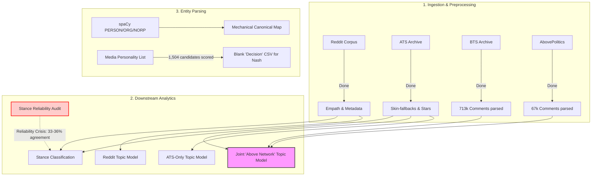

# Project State & Discovery Report: Epistemic Credibility in Online Conspiracy Communities
*Compiled on July 29, 2026, 10:05 AM Local Time*

This report synthesizes findings and current progress across all active pipelines for the Honours thesis project. It reconciles historical logs, git workspace state, local data files, and shared context records from the Oracle `context-repo` database.

---

## 📊 Pipeline Status Matrix



| Component | Status | Target / Artifact Path | Key Metrics / Findings |
| :--- | :---: | :--- | :--- |
| **Reddit Ingestion** | **Done** | `data/raw/r_conspiracy_...` | 18.58M short comments, 21.35M long comments (~40M total). |
| **ATS Ingestion** | **Done** | `data/processed/ats_comments_REPARSED.jsonl` | Reparsed with skin-fallbacks & star overflow fixes. |
| **BTS Ingestion** | **Done** | `data/processed/bts_comments_final_cleaned.parquet` | **100% Complete** (82,462 pages parsed, 713,414 comments). |
| **AbovePolitics Ingestion** | **Done** | `data/processed/bts_abovepolitics_comments_final.parquet` | **100% Complete** (67,633 comments). |
| **ATS-Only Topic Modeling** | **Done**| `data/processed/bertopic_model_ats_overlap` | 100k overlap-era (2008-2016) model trained (~693MB). |
| **Joint Topic Modeling** | **Ready** | *Blocked on BTS Ingestion* &rarr; **UNBLOCKED** | Joint model on ATS + BTS + AbovePolitics ready to fit. |
| **Stance Reliability** | <span style="color:red">**Crisis**</span> | `data/processed/entity_stance_bigmodel_judged.parquet` | **33-36% true agreement** against Qwen-7B (random chance). |
| **Citation Contamination**| **Resolved** | `job_source_stance_blind_judge_AUTHORITATIVE_2026-07-28` | **43% true contamination**; **59.2% blind agreement** (un-anchored). |
| **Entity Canonicalization**| **Done** | `data/processed/entity_canonical_map.csv` | Reduced 683k entities to 600k (12.2% reduction, zero-cost). |
| **Media Personality List**| **Done** | `data/processed/media_personality_candidates_scored.csv` | 1,504 candidates from Wikipedia categories scored via Aho-Corasick. |
| **GCP Corpus Explorer** | **Active** | `https://api.kahatahi.co.nz/explorer/` | Fully restored following GCP VM suspension. |
| **Persistent Infra** | **Active** | `context.kahatahi.co.nz:8423` (port-forwarded) | Live `context-repo`, `wake-relay`, and `unified-gateway` services. |

---

## 🔍 Critical Deep Dives

### 1. Ingestion: BelowTopSecret & AbovePolitics
> [!NOTE]
> All raw HTML pages (82,462) for BelowTopSecret (BTS) have been successfully fetched from the Wayback Machine. They were parsed cleanly using skin-fallbacks to handle non-tabular page structures. 
> - **BTS Comments**: 713,414 comments written to `bts_comments_final_cleaned.parquet`.
> - **AbovePolitics Comments**: 67,633 comments written to `bts_abovepolitics_comments_final_cleaned.parquet`.
> 
> **Impact**: Joint topic modeling for the "Above Network" (ATS + BTS + AbovePolitics) is now **100% unblocked** and can proceed immediately. This will provide a tonal off-topic register (BTS) and moderation contrast (AbovePolitics) matching the holistic coverage of the Reddit model.

---

### 2. Analytical Crisis: Stance Classifier Reliability
A major methodological breakthrough (and complication) occurred during the 2026-07-28 sessions after auditing the stance classifiers against independent, open-weight big models (Qwen-7B-Instruct).

```
Platform/Construct      Match Rate (Original)    Blind Re-Judge Agreement
-------------------------------------------------------------------------
Entity-Stance (All)         33% - 36%             -- (Confirmed Broken)
Citation Contamination      83% - 88%             43.0% (True Boilerplate)
Citation Agreement          32% - 45%             59.2% (True Agreement)
```

> [!CAUTION]
> #### The Prompt-Anchoring / Sycophancy Bug (Retracted Findings)
> The initial high-contamination (88%) and low-agreement (32%) citation numbers from July 28 morning were **withdrawn** because the evaluation prompt showed the judge the classifier's `predicted_label` and asked if it was "defensible." This anchored the model and primed it to agree and post-hoc rationalize (~89.6% of reasoning fields literally said "the classifier correctly identifies...").
> 
> #### The Blind Re-Judge Verdict
> When run blind (the model never sees the target predicted label), the true numbers emerged:
> 1. **True Contamination**: **43%** (down from 83-88%).
> 2. **True Agreement on Non-Contaminated Citations**: **59.2%** (ATS: 64.9%, Reddit: 41.2%).
> 3. **Entity-Stance Crisis (Confirmed)**: The entity-stance classifier's **33-36% overall match rate was fully corroborated** by the larger 7B model. On its high-confidence subset, the 7B judge disagreed with the classifier 73.4% of the time. 
> 
> **Downstream Block**: This reliability crisis must be addressed before treating any downstream metrics that rely on entity-stance labels (e.g., `build_extended_entity_stance.py`, `build_maverick_stance_queue.py`) as analytically valid.

---

### 3. Entity Expansion & Deduplication
To solve the top-down/bottom-up trade-offs in entity parsing, two successful tasks were completed:

*   **Mechanical Canonicalization**: `build_entity_canonical_map.py` case-folds and strips punctuation to map identical strings. It safely handles Unicode-stylized mathematical text and non-ASCII characters (preventing empty string merges like the initial "🤔🤔🤔" cluster bug).
    *   **Result**: 683,635 &rarr; 600,558 distinct entity strings (12.2% reduction) with zero LLM cost or semantic hallucination risk.
*   **Media Personality Candidate List**: Generated a clean bottom-up candidate list of 1,504 TV/talk-show hosts, political commentators, podcasters, and radio hosts from Wikipedia. Scored their real mention frequency across the multi-million row corpus via Kaggle-hosted CPU Aho-Corasick matching.
    *   **Result**: Output saved to `data/processed/media_personality_candidates_scored.csv` with a blank `decision` column for Nash's manual review (respecting the standing guardrail). Calibration targets (Alex Jones: 50,497, Joe Rogan: 17,003, Tucker Carlson: 8,895) are highly plausible.

---

### 4. Infrastructure & Integration Status
*   **Shared Oracle VM**: Serves `context-repo` (ports 8420/8421), `wake-relay` (port 8422), and `unified-gateway` (port 8423) persistently under systemd control.
*   **Claude.ai Custom Connector**: Integrates successfully. The gateway was modified to bypass auth checks for OAuth discovery paths (`/.well-known/oauth-...`) and instead return a standard `404` (instructing the client to proceed without OAuth) rather than a blanket `401` unauthorized response. It also supports `?token=` query parameter fallback.
*   **GCP VM Restored**: The VM hosting the live explorer (`api.kahatahi.co.nz`) was suspended due to a blunt, binary billing hard-stop script on the billing account trigger. It has been fully re-linked and restored.

---

## 🛤 Proposed Pathways

We are at a natural junction point. We can pivot into three possible directions:

### 🚀 Path A: Joint "Above Network" Topic Model (Phase 2)
Complete the final unified topic model. We will combine the fully parsed ATS, BTS, and AbovePolitics comments, extract embeddings, and fit a native combined BERTopic model on Kaggle. This directly resolves `task_ats_topic_modeling.md`.

### 🛠 Path B: Stance Classifier Reliability Refactor
Investigate why the entity-stance classifier performs at near-random agreement. We will explore structural changes, such as moving to a two-stage classification cascade (confidence filtering &rarr; small local SFT model &rarr; reasoning LLM on residuals) or retraining the classifier using un-anchored blind judge training data.

### 📋 Path C: Review and Refinement
Provide Nash with the `media_personality_candidates_scored.csv` and resolved entity alignments for manual review and curation, and assist in refining the live corpus explorer dashboard metrics.
