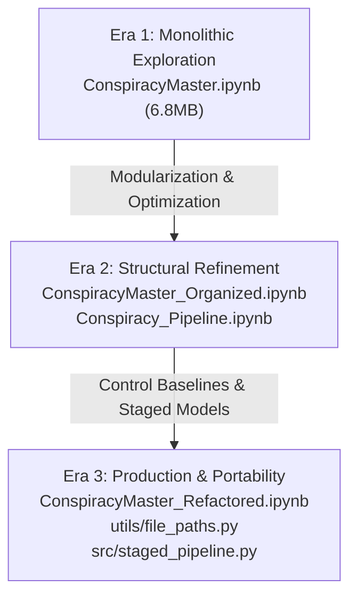

# Epistemic Credibility Project: Pipeline Lineage & Historical Audit

> **AUDIT PURPOSE**: This document provides a historical record of the developmental lineage of the Honours thesis research program: **"Epistemic Credibility in Online Conspiracy Communities."** It explains the technical progression of the codebase through its archived notebooks and delivers a systematic, 8-part scientific audit of the abandoned, early spaCy-based FactAppeal syntactic attribution approach, justifying its replacement by the current Human-in-the-Loop (HITL) TF-IDF + Logistic Regression staged classifier.

---

## 1. Succession of Analysis Notebooks & Major Architectural Transitions

Over the course of this research, **17 archived notebooks** (stored under `notebooks/archive/` and `notebooks/legacy_production/`) were created. The development progressed through three major architectural eras:

### Era 1: Monolithic Exploration (June 2026)
* **Primary Notebook**: [ConspiracyMaster.ipynb](file:///Users/nash/Projects/ConspiracyComments/notebooks/archive/ConspiracyMaster.ipynb) (~6.8MB)
* **Characteristics**: Sprawling, single-file development containing raw data loading, corpus filtering, early lexicon definition, BERTopic clustering, and initial regression runs.
* **Why Abandoned**:
  * Giant file size caused severe browser rendering latency, Git warning limits, and notebook save corruption risks.
  * Paths were hardcoded to absolute local paths (e.g., `/Users/nash/Documents/ConspiracyComments/...`), violating reproducibility.
  * Contained several exploratory dead-ends (such as the spaCy dependency parser and r/TopMindsOfReddit as a control baseline) that needed to be pruned.

### Era 2: Structural Refinement & Caching (Late June – Early July 2026)
* **Key Notebooks**: [ConspiracyMaster_Organized.ipynb](file:///Users/nash/Projects/ConspiracyComments/notebooks/archive/ConspiracyMaster_Organized.ipynb), [ConspiracyMaster_Final_Architecture.ipynb](file:///Users/nash/Projects/ConspiracyComments/notebooks/archive/ConspiracyMaster_Final_Architecture.ipynb), [Conspiracy_Pipeline.ipynb](file:///Users/nash/Projects/ConspiracyComments/notebooks/legacy_production/Conspiracy_Pipeline.ipynb).
* **Characteristics**: Separated heavy pre-processing operations (e.g., lexical scoring over 40M raw comments, custom lexicon dictionary token-contains, and NLP entity extraction) into `Conspiracy_Pipeline.ipynb` to cache pre-computed Parquet files.
* **Why Abandoned**:
  * Still relied on rigid, rule-based heuristics for core constructs, which suffered from high false-negative and false-positive rates on casual Reddit text.
  * The control subreddits were still in flux, with r/TopMindsOfReddit subsequently identified as highly sarcastic and temporally biased.

### Era 3: Production & Replication Readiness (July 2026)
* **Active Master Notebook**: [ConspiracyMaster_Refactored.ipynb](file:///Users/nash/Projects/ConspiracyComments/ConspiracyMaster_Refactored.ipynb)
* **Supporting Modules**: [utils/file_paths.py](file:///Users/nash/Projects/ConspiracyComments/utils/file_paths.py), [src/staged_pipeline.py](file:///Users/nash/Projects/ConspiracyComments/src/staged_pipeline.py).
* **Characteristics**: Fully portable relative-path resolution; heavy compute compiled to discrete Python scripts under `src/`; control baseline solidified as temporally stratified r/politics; and core predictors validated using Human-in-the-Loop ground truth.

---

## 2. Legacy spaCy FactAppeal Predecessor: 8-Part Scientific Audit

The original attempt to model the **"FactAppeal"** (attribution to sources) construct relied on a rule-based syntactic dependency parsing pipeline built with the spaCy library.

### 1. Description
A syntactic parser designed to isolate reporting verbs (e.g., "said", "reported", "claims") and traverse the grammatical dependency tree of a comment to link the verb to its subject. If the subject matched a named entity (e.g., `PERSON` or `ORG`), it was classified into specific attribution categories like Named Expert, Named Official, News Report, or Unnamed Source.

### 2. Location
* **Derivation Code**: [Conspiracy_Pipeline.ipynb](file:///Users/nash/Projects/ConspiracyComments/notebooks/legacy_production/Conspiracy_Pipeline.ipynb) cells 21–24 (starting at line 1700).
* **Output Assets**: `data/processed/spacy_attributed_comments.parquet` (279.9MB) and `data/processed/spacy_audit_scratchpad.csv`.

### 3. Derivation Heuristic
The raw comment text was truncated to the first 500 characters and processed via spaCy's standard English pipeline (`nlp.pipe` with multiprocessing over 6 cores). The function `classify_attribution_doc(doc)` mapped grammatical dependency relations:
1. Isolate the token if its POS tag is `VERB` and its lemma is in a pre-defined list of reporting verbs.
2. Check the verb's dependents for subjects (`nsubj`, `nsubjpass`).
3. Cross-reference the subject tokens against extracted named entities (`PERSON`, `ORG`) and custom dictionaries of official bodies (e.g., "CDC", "WHO") and news organizations.
4. Assign one of 9 hierarchical classes (e.g., `Direct_Quote:Named`, `Indirect_Quote:Unnamed_Source`).

### 5. Critical Technical & Analytical Limitations
* **Computational Infeasibility at Scale**: Processing only 614,888 comment candidates capped at 500 characters took **30.6 minutes** using 6 parallel processes. To run this over the entire 21.4M length-filtered corpus would require **17.4 hours** of high-end compute, making iteration or pipeline re-runs extremely expensive.
* **Extreme Sparsity (The Zero-Variance Trap)**:
  * **No Clear Attribution**: **98.91%** of comments (608,202 / 614,888) fell into the null category.
  * **Remaining Classes**: Only **1.09%** of the entire dataset had a positive attribution flag, split across 8 sub-categories. The largest category was `Indirect_Quote:Unnamed_Source` at a microscopic **0.51%** (3,138 comments).
  * **Impact**: This extreme class imbalance introduces a "quasi-complete separation" problem in statistical regressions, yielding near-zero statistical power and making it impossible to evaluate community engagement dynamics.
* **Brittle Rule Heuristics**: Rigid dependency chains fail to capture the informal ways online users attribute information (e.g., posting raw hyperlinks, using casual markdown blockquotes, or mentioning names in list formats without standard subject-verb relations).

### 6. Construct Validity
Low construct validity for online conversational spaces. The construct intended to measure *appeal to evidence*, but the tool measured *formal syntactic quoting behavior*. A user citing a scientific study via a URL has strong "FactAppeal" but was classified as `No_Clear_Attribution` by the spaCy parser because they didn't write "a study says...".

### 7. Analytical Impact
* **Completely Superseded/Orphaned**: No live analysis, baseline calculations, or regression models in `src/` or the refactored master notebook read `spacy_attributed_comments.parquet` or `spacy_audit_scratchpad.csv`.
* **Zero System Collision**: Safe to ignore or prune during active regression runs, as they represent a completely isolated historical path.

### 8. Replacement Rationale (Next Steps)
To address the limitations of the spaCy predecessor, the project transitioned to a **Staged Hybrid Pipeline (TF-IDF + Logistic Regression + LLM-Verification)** for the `source_citation` and `hedged_suspicion` constructs:
1. **Speed**: TF-IDF scoring and linear log-reg inference scale to 21M rows in seconds/minutes instead of hours.
2. **Quality**: Grounded in Human-in-the-Loop (HITL) annotations, capturing how Reddit users *actually* attribute sources (including hyperlinks, parenthetical mentions, and informal evidence cues).
3. **Robustness**: Validated systematically with formal chance-corrected agreement, achieving high academic defensibility:
   * `source_citation`: $\kappa = 0.869$, $F_1 = 0.896$
   * `hedged_suspicion`: $\kappa = 0.872$, $F_1 = 0.933$
