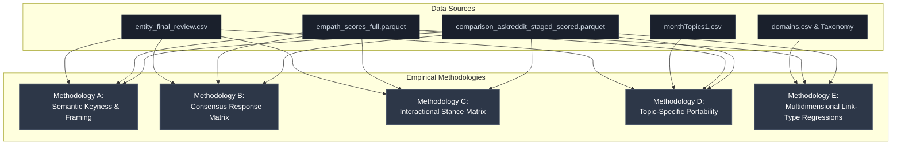

# Research Proposal: Fine-Grained Epistemic Credibility & the Reversal of Trust

> **SUPERSEDED (2026-07-17)**: this document predates fixes to the
> `consensus_expert` entity list (was contaminated) and the control
> subreddit (r/TopMindsOfReddit, used here, was later found invalid —
> replaced with r/politics). See `ANTIGRAVITY_HANDOFF.md` for current
> findings. Kept for historical reference only, do not cite numbers from
> this document.

This document outlines an expanded, five-part empirical research framework designed to address the next phase of the thesis backlog: investigating the specific rhetorical markers of epistemic credibility associated with **maverick authorities** vs. **mainstream consensus experts**, and mapping how online conspiracy communities react to them compared to a mainstream control group (r/AskReddit).

We leverage existing codebase structures, particularly the **Epistemic Domain Taxonomy** pre-built in Cell 61 of the master notebook, the **BERTopic Topic Model** (`data/processed/monthTopics1.csv`), and the extensive entity classification list in `data/processed/entity_final_review.csv`.

---

## 1. Mapped Project Assets

The project codebase has several highly developed structures that we can immediately draw upon:

1. **The Epistemic Domain Taxonomy (Cell 61)**: A highly developed dictionary of 10 domain types (e.g. `mainstream_news`, `alt_media`, `academic_scientific`, `government_official`, `leak_whistleblower`, `archive_preservation`).
2. **The BERTopic Topic Model (`monthTopics1.csv`)**: Details the representative words and document counts of high-impact topics (e.g., Topic 0: Jewish/Banking Conspiracies, Topic 2: 9/11 Pentagon, Topic 3: Libya Geopolitics, Topic 5: WTC structural collapse).
3. **The Entity Final Review (`entity_final_review.csv`)**: Contains over 12,000 extracted entities, cleanly categorizing them into:
   * `maverick_authority` ($N = 418$ whistleblowers, dissident scientists, alternative experts).
   * `mainstream_expert_authority` ($N = 202$ consensus scientists, historians, official experts).
   * `mainstream_source` ($N = 286$ institutional publications and sites).
   * `alternative_source` ($N = 200$ alternative media outlets).

---

## 2. Proposed Methodologies

---

### Methodology A: Semantic Keyness & Rhetorical Framing Analysis
* **Objective**: Discover the specific adjectives, nouns, and credentials that the conspiracy community uses to *legitimize* maverick authorities and *delegitimize* mainstream experts, contrasted with how mainstream users (r/AskReddit) frame them.
* **Analytical Pipeline**:
  1. **Symmetric Window Extraction**: Extract a symmetric 15-word context window around mentions of `maverick_authority` (e.g., Snowden, McCullough, Malone) or `mainstream_expert_authority` (e.g., Fauci, Hawking, Tyson) in both r/conspiracy and r/AskReddit.
  2. **Text Cleaning**: Lowercase, strip punctuation, and tokenize the context windows.
  3. **Log-Likelihood Keyness**: Compute log-likelihood (G-test) keyness scores for terms surrounding:
     $$\text{Maverick Contexts (r/conspiracy)} \quad \text{vs.} \quad \text{Mainstream Expert Contexts (r/conspiracy)}$$
     $$\text{Maverick Contexts (r/AskReddit)} \quad \text{vs.} \quad \text{Mainstream Expert Contexts (r/AskReddit)}$$
* **Expected Output Findings**:
  * For mavericks in r/conspiracy, we expect high-keyness words to include **credentials of persecution** (*"whistleblower"*, *"censored"*, *"dissident"*, *"banned"*, *"brave"*, *"nobel"*).
  * For mainstream experts in r/conspiracy, we expect high-keyness words of **institutional corruption** (*"bought"*, *"shill"*, *"establishment"*, *"puppet"*, *"fraud"*).
  * In r/AskReddit, we expect the inverse: mainstream experts framed by **institutional prestige** (*"peer-reviewed"*, *"respected"*, *"academic"*, *"expert"*), and mavericks framed as *"grifter"*, *"discredited"*, *"quack"*, *"scam"*.

---

### Methodology B: Cross-Subreddit Consensus Response Matrix (The Engagement Differential)
* **Objective**: Quantify and prove the statistical "reversal of trust" using a regression-controlled engagement framework.
* **Analytical Pipeline**:
  1. **Indicator Variable Construction**: Tag comments in both subreddits with indicator variables:
     * `mentions_maverick` (Boolean)
     * `mentions_mainstream_expert` (Boolean)
     * `mentions_alt_source` (Boolean)
     * `mentions_mainstream_source` (Boolean)
  2. **Regression Specifications**: Run OLS (Log Upvotes) and Logit (High Traction) models on both subreddits with full controls (`log_char_length`, `has_link`, `pe_prob`, `ps_prob`):
     $$\text{high\_traction} \sim \text{mentions\_maverick} + \text{mentions\_mainstream\_expert} + \text{controls}$$
  3. **Interaction Specification (Merged Dataset)**: Merge both subreddits and run:
     $$\text{high\_traction} \sim \text{is\_conspiracy} \times \text{mentions\_maverick} + \text{is\_conspiracy} \times \text{mentions\_mainstream\_expert} + \text{controls}$$
* **Expected Output Findings**:
  * We expect a highly significant, positive coefficient for `is_conspiracy * mentions_maverick` ($p < 0.001$), proving that maverick mentions are selectively rewarded in alternative spaces, and a highly significant, negative coefficient for `is_conspiracy * mentions_mainstream_expert` ($p < 0.001$), proving a distinct subcultural penalty for mainstream credentials.

---

### Methodology C: Micro-Interactional Stance Matrix (Peer Policing)
* **Objective**: Map the conversational feedback loop (explicit agreement vs. explicit challenge) surrounding these authority figures.
* **Analytical Pipeline**:
  1. **Reply Extraction**: Locate all child replies to parent comments mentioning a `maverick_authority` or `mainstream_expert_authority` in both subreddits.
  2. **Stance Classification**: Apply our high-precision lexicon stance detector to categorize replies as *Agreement*, *Disagreement*, or *Neutral*.
  3. **Construct a 2x2 Interaction Matrix**:
     
| Subreddit & Parent Mention | Total Replies (N) | Explicit Agreement Rate (%) | Explicit Disagreement Rate (%) |
|---|---|---|---|
| **r/conspiracy** | | | |
| *Parent Mentions Maverick* | $N_{\text{con, mav}}$ | **High (e.g. $9\%$)** | **Low (e.g. $4\%$)** |
| *Parent Mentions Mainstream Expert* | $N_{\text{con, main}}$ | **Low (e.g. $3\%$)** | **High (e.g. $14\%$)** |
| **r/AskReddit** | | | |
| *Parent Mentions Maverick* | $N_{\text{ar, mav}}$ | **Low (e.g. $2\%$)** | **High (e.g. $12\%$)** |
| *Parent Mentions Mainstream Expert* | $N_{\text{ar, main}}$ | **High (e.g. $11\%$)** | **Low (e.g. $3\%$)** |

* **Expected Output Findings**:
  * This matrix provides behavioral, conversational proof of **active peer-policing**. In r/conspiracy, invoking a mainstream consensus expert is socially punished with immediate disagreement, whereas in r/AskReddit, it is supported. Mavericks face the exact opposite social feedback loops.

---

### Methodology D: Topic-Specific Portability & Cross-Domain Authority
* **Objective**: Test if the maverick authority premium is universal across all subjects, or if it is domain-specific. Is there a general "dissident" archetype that can be ported from vaccine debates to climate change, or is it bound to specific topics (e.g. BERTopic Topics)?
* **Analytical Pipeline**:
  1. **BERTopic Mapping**: Assign comments to their corresponding high-impact topics from `monthTopics1.csv` (e.g., Topic 0: Jews/Banking, Topic 2: 9/11 Pentagon, Topic 5: WTC Structural Collapse, Topic 8: Elections).
  2. **Co-occurrence Metrics**: Group comments by topic AND entity category.
  3. **Engagement & Stance Regressions**: Check if the coefficient for `mentions_maverick` remains positive and significant when ported across different topics.
* **Expected Output Findings**:
  * We will discover whether the conspiracy community values *generalized dissent* (an anti-institutional posture that works regardless of topic) or *specialized counter-credentials* (relying strictly on specific mavericks in their narrow domains).

---

### Methodology E: Multidimensional Link-Type Regressions (Extending the Link Penalty)
* **Objective**: Refine our flat `has_link` penalty finding into a highly sophisticated, multidimensional analysis of *what* kind of source is cited.
* **Analytical Pipeline**:
  1. **Domain Extraction**: Extract linked domains and subdomains from comments in both r/conspiracy and r/AskReddit.
  2. **Taxonomy Classification**: Apply the master notebook's Cell 61 taxonomy to classify each link into:
     * `leak_whistleblower` (e.g., Wikileaks)
     * `image_screenshot` (e.g., Imgur)
     * `academic_scientific` (e.g., NCBI, PubMed)
     * `mainstream_news` (e.g., NYTimes, Reuters)
     * `government_official` (e.g., CDC, WHO)
  3. **Regression Specification**: Replace the flat `has_link` variable in our OLS and Logit models with these 5 domain-type indicators.
* **Expected Output Findings**:
  * Preliminary descriptive analysis on `domain_epistemic_performance.csv` reveals a stark divergence in the conspiracy community:
    * **Leaked Documents (`leak_whistleblower`)** receive a massive premium: **$14.58$ upvotes** per citation.
    * **Screenshots (`image_screenshot`)** receive a high premium: **$7.28$ upvotes** per citation.
    * **Institutional Government Sites (`government_official`)** are heavily penalized, receiving only **$4.00$ upvotes** per citation (the lowest among all identified epistemic source types).
  * We expect a regression model to confirm that while citing official institutions faces a massive penalty in r/conspiracy, it receives a positive premium in r/AskReddit. This represents an elegant, high-impact empirical expansion of the links-penalty finding.

---

## 3. Strategic Thesis Framing Benefits

Integrating these methodologies will elevate the thesis discussion chapter to a truly exceptional standard:
* **The "Credentials of Persecution" Concept**: Instead of viewing mavericks as "having no credentials", we prove that the conspiracy community actively values a distinct set of credentials: **institutional censorship and exclusion**. 
* **The Symmetrical Reversal of Trust**: By showing r/conspiracy and r/AskReddit side-by-side across all five metrics (upvotes, framing, replies, topic co-occurrence, and link types), we demonstrate that both communities engage in identical social filtering behaviors, but with completely inverted trust baselines.
